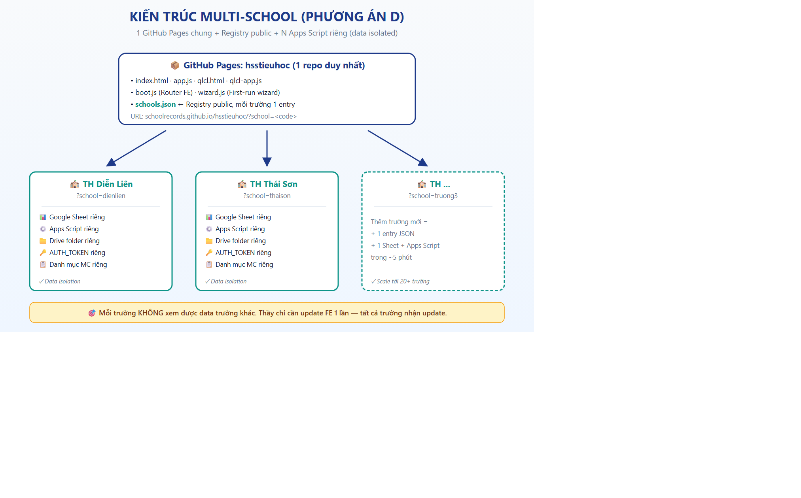
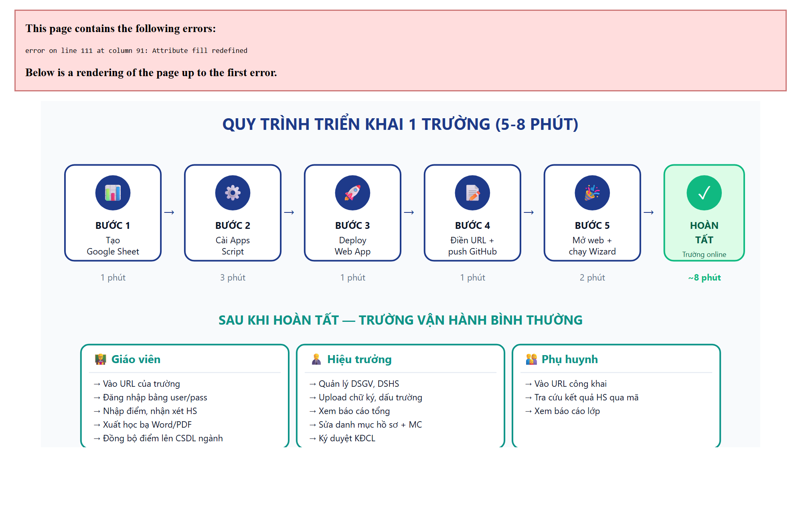
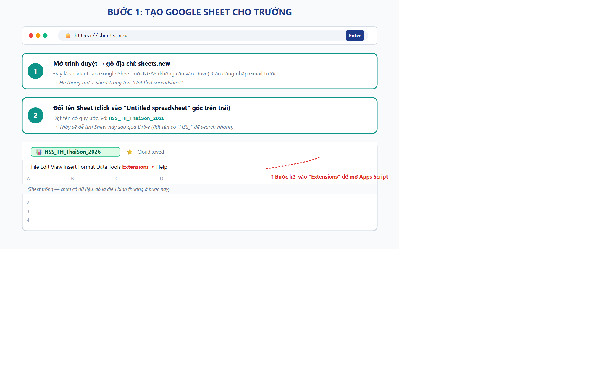
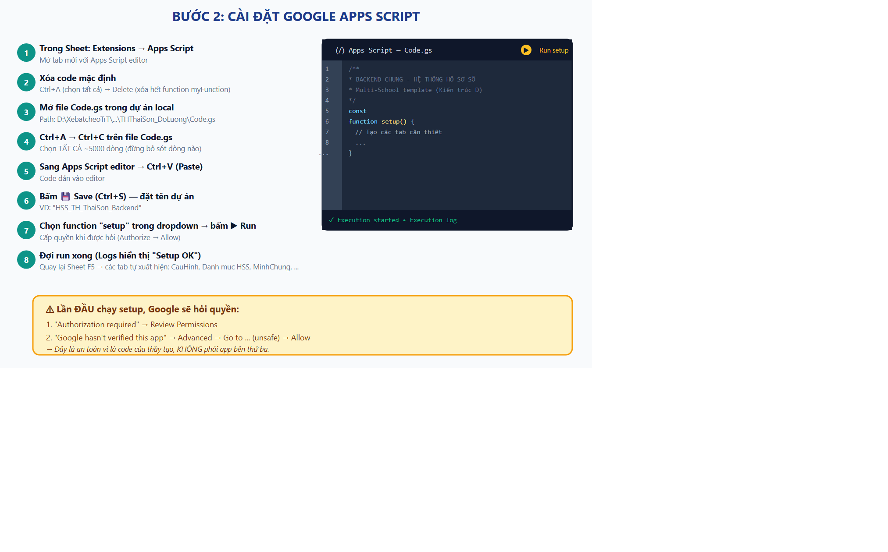
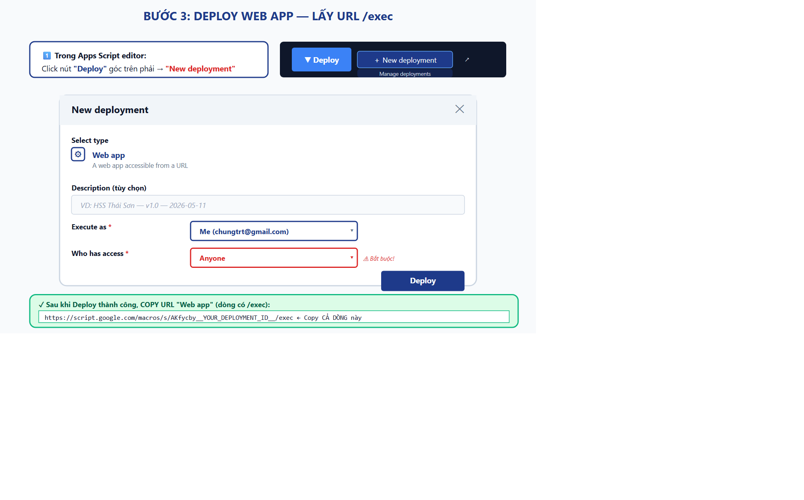
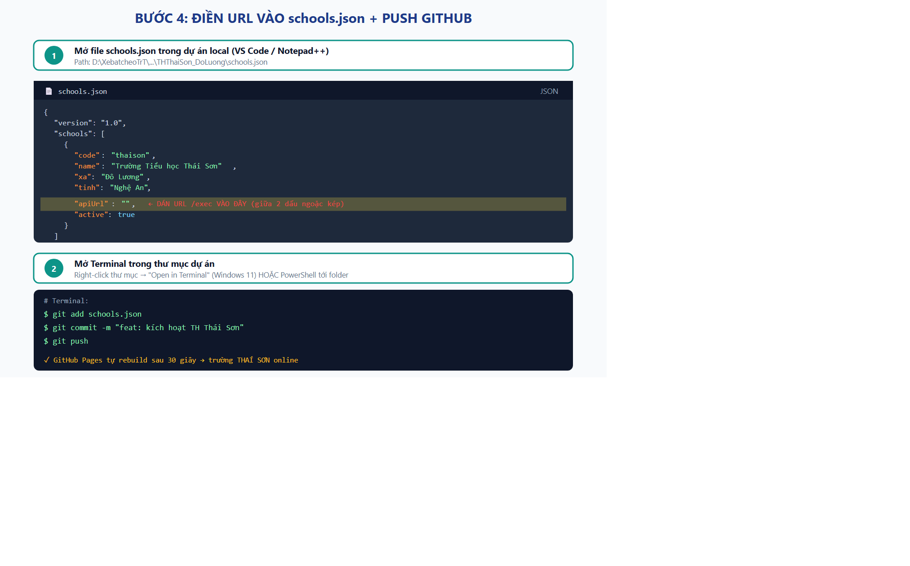
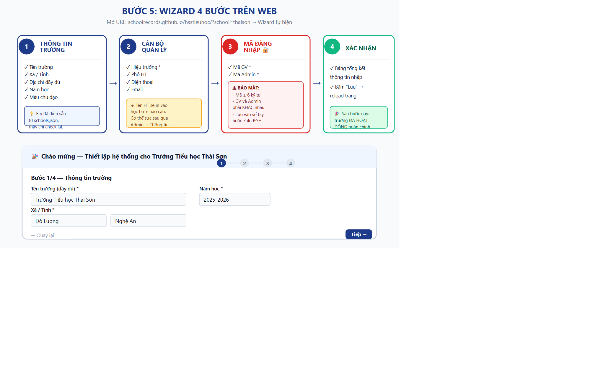
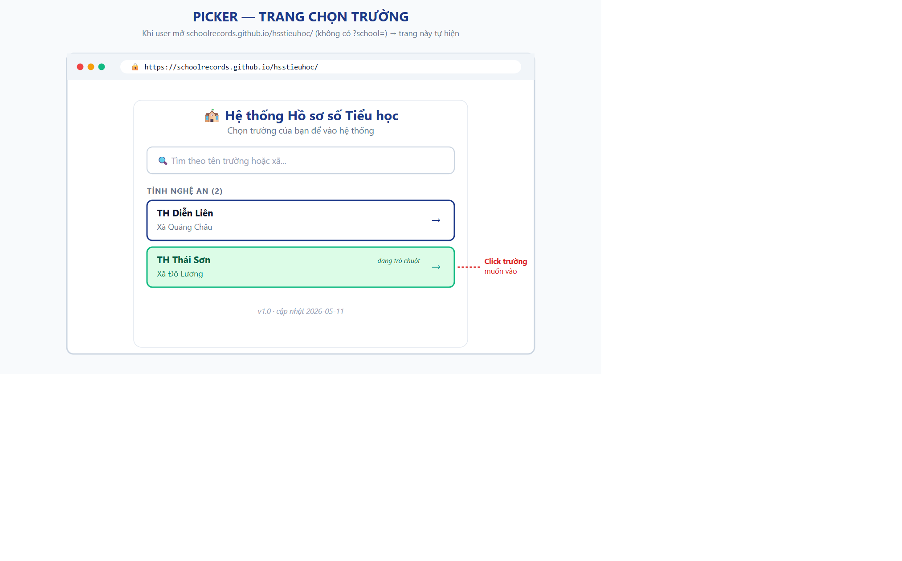

# 🎯 LỜI MỞ ĐẦU

Cảm ơn quý thầy/cô đã tin dùng Hệ thống Hồ sơ số. Tài liệu này hướng dẫn **TỪNG BƯỚC, KÈM HÌNH ẢNH MINH HỌA**, để quý thầy/cô tự triển khai hệ thống cho trường mình mà **KHÔNG cần biết lập trình**.

**Đối tượng**: Hiệu trưởng / Phó Hiệu trưởng / Cán bộ phụ trách CNTT của trường tiểu học.

**Thời gian triển khai 1 trường**: 5-8 phút (sau khi đã đọc xong tài liệu này 1 lần).

**Hệ thống phục vụ những việc gì?**

1. **Hồ sơ số (HSS)** — Lưu trữ danh mục hồ sơ nhà trường + minh chứng theo Thông tư 17/2018 và 22/2024
2. **Quản lý chất lượng (QLCL)** — Sổ điểm điện tử, nhận xét HS, xếp loại theo Thông tư 27/2020/TT-BGDĐT
3. **Kiểm định chất lượng (KĐCL/TĐG)** — Báo cáo tự đánh giá nhà trường
4. **Học bạ số** — Xuất Word/PDF tự động, có chữ ký + dấu trường, lưu Drive
5. **Đồng bộ CSDL ngành MOET** — Qua Chrome Extension, tự động upload Excel

\newpage

# 📐 PHẦN 1: TỔNG QUAN KIẾN TRÚC



## 1.1. Triết lý thiết kế

Hệ thống được thiết kế theo nguyên tắc **"1 codebase phục vụ N trường"**:

| Thành phần | Trạng thái | Ghi chú |
|---|---|---|
| **Website (FE)** | 1 chỗ chung cho tất cả trường | Mỗi update code áp dụng tức thì cho mọi trường |
| **Registry** (file `schools.json`) | 1 file chung, public | Mỗi trường = 1 entry JSON |
| **Backend (Apps Script)** | Mỗi trường có 1 cái riêng | Đảm bảo data isolation tuyệt đối |
| **Google Sheet** | Mỗi trường có 1 cái riêng | Lưu HS, điểm, MC, cấu hình |
| **Google Drive folder** | Mỗi trường có 1 cái riêng | Lưu học bạ PDF, chữ ký, ảnh |

## 1.2. Lợi ích so với cách cũ

| Tiêu chí | Cách cũ (mỗi trường 1 fork code) | Kiến trúc D mới |
|---|---|---|
| Triển khai trường mới | 2-3 giờ (fork, sửa 200 chỗ, test) | **5-8 phút** |
| Cập nhật chức năng | Sửa 20 repo riêng | **Push 1 lần, áp dụng tất cả** |
| Admin trường setup | Cần dev hỗ trợ từng bước | **Wizard 4 bước tự làm** |
| Data isolation | ✓ | ✓ |

## 1.3. Quy trình tổng quan triển khai 1 trường



\newpage

# 🛠 PHẦN 2: CHUẨN BỊ TRƯỚC KHI TRIỂN KHAI

## 2.1. Tài khoản cần có

| Loại tài khoản | Mục đích | Bắt buộc? |
|---|---|---|
| **Gmail** của trường (vd: hsstruong@gmail.com) | Tạo Sheet + Apps Script + Drive | ✓ Bắt buộc |
| **GitHub** (vd: schoolrecords) | Quản lý code FE + schools.json | ✓ Bắt buộc (1 lần) |
| **Chrome browser** (mới nhất) | Cài Chrome Extension HSS Sync | Khuyến nghị |

> ⚠️ **Lưu ý**: Tài khoản Gmail của trường nên là tài khoản **riêng cho hệ thống** (không phải Gmail cá nhân Hiệu trưởng), để không mất khi nhân sự thay đổi.

## 2.2. Thông tin cần chuẩn bị sẵn

Mở sổ tay ghi sẵn 8 mục dưới (sẽ điền vào wizard ở Bước 5):

1. ☐ Tên đầy đủ của trường (vd: *Trường Tiểu học Thái Sơn*)
2. ☐ Xã (vd: *Đô Lương*) — chỉ tên xã, không kèm "Xã"
3. ☐ Tỉnh (vd: *Nghệ An*)
4. ☐ Năm học hiện tại (vd: *2025-2026*)
5. ☐ Họ tên Hiệu trưởng đầy đủ
6. ☐ Họ tên Phó Hiệu trưởng (nếu có)
7. ☐ Số điện thoại trường + Email trường
8. ☐ Mã đăng nhập GV và mã Admin (2 mã KHÁC nhau, ≥6 ký tự — đặt mã mạnh)

> 💡 **Gợi ý mã đăng nhập an toàn**:
> - **Mã GV** cấp cho 20-30 giáo viên dùng: vd `ThaiSon-2026` (đổi vào năm sau)
> - **Mã Admin** CHỈ Hiệu trưởng + Phó HT giữ: vd `AdminTS@2026` (có ký tự đặc biệt cho mạnh)

\newpage

# 📊 PHẦN 3: BƯỚC 1 — TẠO GOOGLE SHEET CHO TRƯỜNG



## 3.1. Mở trình duyệt (Chrome khuyến nghị)

Gõ vào thanh địa chỉ: **`sheets.new`** (gõ rồi Enter)

> 💡 Đây là **shortcut chính thức của Google** để tạo Sheet mới ngay. Không cần qua Drive.

## 3.2. Đặt tên Sheet

Sheet trống mới tạo có tên *"Untitled spreadsheet"* ở góc trên trái. **Click vào** để đổi tên.

**Quy ước đặt tên** (giúp dễ tìm sau này):

```
HSS_TH_[TenTruongNgan]_[Nam]
```

**Ví dụ**:
- `HSS_TH_ThaiSon_2026`
- `HSS_TH_DienLien_2026`
- `HSS_TH_ABC_2026`

Bấm **Enter** để lưu tên.

## 3.3. Lúc này

✅ Sheet mới đã được tạo, có URL dạng `https://docs.google.com/spreadsheets/d/XXXXXXX/edit`.
✅ Sheet trống — đó là điều **bình thường**. Apps Script sẽ tạo các tab dữ liệu ở bước sau.

> ⏭️ Tiếp tục sang **Bước 2** (đừng đóng tab này).

\newpage

# ⚙️ PHẦN 4: BƯỚC 2 — CÀI ĐẶT GOOGLE APPS SCRIPT



## 4.1. Mở Apps Script Editor

Trong Sheet vừa tạo:

1. Click menu **`Extensions`** (Tiện ích mở rộng) trên thanh menu trên cùng
2. Chọn **`Apps Script`**
3. Một **tab mới** mở ra với Apps Script editor

## 4.2. Xóa code mặc định

Apps Script editor có sẵn 1 đoạn code mẫu:

```javascript
function myFunction() {
}
```

**Xóa hết**: Click vào vùng code → **Ctrl+A** (chọn tất cả) → **Delete**

## 4.3. Lấy code từ dự án local

Mở **File Explorer** trên máy thầy, đi đến thư mục dự án:

```
D:\XebatcheoTrT\1\EduTech_ChungTran\Code\HoSoSo_TH\THThaiSon_DoLuong\
```

Mở file **`Code.gs`** bằng **Notepad** hoặc **VS Code** (khuyến nghị VS Code vì xem code có màu sẽ dễ check).

Trong Code.gs:
- **Ctrl+A** (chọn tất cả ~5000 dòng)
- **Ctrl+C** (copy)

## 4.4. Paste vào Apps Script

Quay lại tab Apps Script editor:
- Click vào vùng code (đã xóa code cũ)
- **Ctrl+V** (paste)

Toàn bộ code Multi-School template được dán vào.

## 4.5. Lưu dự án

Bấm icon **💾 Save** (góc trên trái) hoặc **Ctrl+S**.

Hệ thống hỏi tên dự án — đặt vd: **`HSS_TH_ThaiSon_Backend`**.

## 4.6. Chạy hàm setup()

1. Phía trên editor có dropdown chọn function (mặc định `myFunction` — giờ đã thay)
2. Click dropdown → chọn **`setup`**
3. Click nút **▶ Run** (Chạy)

### ⚠️ Lần đầu chạy, Google sẽ hỏi quyền

Đây là quy trình **bình thường** với mọi Apps Script tự viết:

| Bước | Click |
|---|---|
| 1. "Authorization required" | **Review Permissions** |
| 2. Hộp chọn tài khoản | Chọn Gmail của trường |
| 3. "Google hasn't verified this app" | **Advanced** (góc dưới trái) |
| 4. "Go to ... (unsafe)" | **Click vào link đó** |
| 5. "... wants to access..." | **Allow** |

> 🔒 **Tại sao Google cảnh báo?** Vì code này là **của thầy tự paste**, không phải app được Google review chính thức. Đối với code mình tự kiểm soát, đây là **AN TOÀN**.

## 4.7. Kiểm tra kết quả

- Quay lại tab Sheet → bấm **F5** (refresh)
- Các tab mới tự xuất hiện ở dưới Sheet: `CauHinh`, `Danh muc HSS`, `MinhChung`, `DSGV`, `DS HocSinh`, `Hinh Anh`, ...
- ✅ Bước 2 hoàn thành nếu thấy các tab này

> ❌ **Nếu KHÔNG thấy tab nào tạo ra**: kiểm tra log trong Apps Script (menu `View → Logs`) xem có lỗi không. Lỗi thường gặp: "Permission denied" → bấm Run lại lần nữa và cấp quyền.

\newpage

# 🚀 PHẦN 5: BƯỚC 3 — DEPLOY WEB APP



## 5.1. Mở dialog Deploy

Trong Apps Script editor:
1. Click nút **`Deploy`** (góc trên phải, màu xanh)
2. Chọn **`New deployment`** (Triển khai mới)

## 5.2. Chọn loại Web App

Trong dialog mở ra:

1. Click icon **⚙️** bên trái "Select type"
2. Chọn **`Web app`**

## 5.3. Cấu hình deployment

Điền 3 mục:

| Mục | Điền gì | Bắt buộc? |
|---|---|---|
| **Description** | VD: `HSS Thái Sơn - v1.0 - 2026-05-11` | Tùy chọn |
| **Execute as** | **`Me (Gmail-cua-truong@gmail.com)`** | ⚠️ Quan trọng |
| **Who has access** | **`Anyone`** | ⚠️ Bắt buộc, không Anyone là KHÔNG hoạt động |

> ⚠️ **`Anyone` ở mục "Who has access" KHÔNG NGHĨA LÀ AI CŨNG SỬA ĐƯỢC DATA**. Nó chỉ cho phép trình duyệt **gọi API** đến Apps Script. Việc sửa data vẫn cần **mã đăng nhập GV/Admin**. Đây là cấu hình chuẩn cho Web App của Google.

## 5.4. Click Deploy

Bấm nút **`Deploy`** màu xanh dưới cùng dialog.

Đợi 3-5 giây, hệ thống trả về **2 URL**:
- **Web app URL** ← Cái thầy cần
- **Library URL** ← Không dùng

## 5.5. Copy URL Web App

URL có dạng:

```
https://script.google.com/macros/s/AKfycbxXXXXXXXXXXXXXXXXXXXXXX/exec
```

**Copy CẢ DÒNG này** (cuối là `/exec`). Lưu tạm vào Notepad hoặc Sticky Note.

> 📝 **Lưu ý**: URL này là **duy nhất cho trường này**. Đừng share cho trường khác. Nếu lộ ra ngoài thì cũng không ảnh hưởng vì có AUTH_TOKEN bảo vệ.

\newpage

# 📝 PHẦN 6: BƯỚC 4 — ĐIỀN URL VÀO schools.json + PUSH GITHUB



## 6.1. Mở file schools.json

Trong **VS Code** (hoặc Notepad++), mở file:

```
D:\XebatcheoTrT\1\EduTech_ChungTran\Code\HoSoSo_TH\THThaiSon_DoLuong\schools.json
```

## 6.2. Tìm entry của trường

File có cấu trúc JSON. Tìm entry có `"code": "thaison"` (hoặc mã trường thầy đã định nghĩa):

```json
{
  "code": "thaison",
  "name": "Trường Tiểu học Thái Sơn",
  "shortName": "TH Thái Sơn",
  "xa": "Đô Lương",
  "tinh": "Nghệ An",
  "apiUrl": "",          ← DÒNG NÀY CẦN ĐIỀN
  "primaryColor": "#0d9488",
  "active": true,
  ...
}
```

## 6.3. Dán URL vào trường `apiUrl`

Giữa **2 dấu ngoặc kép** của `"apiUrl": ""`, dán URL `/exec` đã copy ở Bước 3:

```json
"apiUrl": "https://script.google.com/macros/s/AKfycbxXXXXXXXX/exec",
```

> ⚠️ **Cẩn thận**: GIỮ DẤU `,` ở cuối dòng. Đừng xóa nhầm.

## 6.4. Lưu file

**Ctrl+S** để lưu.

## 6.5. Push lên GitHub

Mở **Terminal** (Windows 11: right-click thư mục dự án → "Open in Terminal") hoặc **Git Bash**.

Chạy 3 lệnh sau (paste từng dòng, Enter sau mỗi dòng):

```bash
git add schools.json
git commit -m "feat: kích hoạt TH Thái Sơn"
git push
```

## 6.6. Đợi GitHub Pages rebuild

GitHub Pages sẽ tự build lại trang web trong **~30-60 giây** sau khi push.

Có thể kiểm tra trạng thái build tại:
**`https://github.com/Schoolrecords/hsstieuhoc/actions`**

✅ Bước 4 hoàn thành khi build status hiện màu xanh ✓.

\newpage

# 🎉 PHẦN 7: BƯỚC 5 — CHẠY WIZARD 4 BƯỚC TRÊN WEB



## 7.1. Mở URL trường mình

Mở Chrome → vào địa chỉ:

```
https://schoolrecords.github.io/hsstieuhoc/?school=thaison
```

(Thay `thaison` bằng mã trường của thầy nếu khác)

## 7.2. Wizard tự hiện

Lần đầu mở, hệ thống tự phát hiện **chưa có cấu hình** → tự hiện modal Wizard 4 bước.

> 💡 Lần sau mở, nếu đã chạy wizard rồi, trang sẽ vào thẳng giao diện chính (không hỏi nữa).

## 7.3. Bước 1/4 — Thông tin trường

Wizard đã **pre-fill** từ `schools.json`:
- Tên trường, Xã, Tỉnh, Năm học (đã có sẵn)
- Địa chỉ tự ghép: `Xã Đô Lương, Tỉnh Nghệ An`
- Màu chủ đạo: theo `primaryColor` trong JSON

**Kiểm tra lại**, sửa nếu cần. Bấm **`Tiếp →`**.

## 7.4. Bước 2/4 — Cán bộ quản lý

Nhập:
- **Hiệu trưởng** (bắt buộc, sẽ in vào học bạ + báo cáo)
- **Phó Hiệu trưởng** (tùy chọn)
- **Điện thoại trường** (tùy chọn)
- **Email trường** (tùy chọn)

> 💡 Tên HT/PHT có thể sửa sau qua **Admin → Thông tin trường** nếu thay đổi nhân sự.

Bấm **`Tiếp →`**.

## 7.5. Bước 3/4 — Mã đăng nhập 🔐 (QUAN TRỌNG)

Đặt **2 mã**:

| Mã | Cấp cho ai | Quyền |
|---|---|---|
| **Mã GV** | 20-30 giáo viên trường | Nhập điểm, nhận xét, xuất học bạ |
| **Mã Admin** | CHỈ HT + PHT | Tất cả quyền GV + Admin panel + KĐCL |

**Yêu cầu**:
- ≥ 6 ký tự
- Mã GV ≠ Mã Admin
- Đặt mã mạnh: chữ + số + ký tự đặc biệt

**Ví dụ tốt**:
- Mã GV: `ThaiSon-2026`
- Mã Admin: `AdminTS@2026!`

> ⚠️ **LƯU 2 mã này NGAY** vào sổ tay BGH hoặc Zalo nhóm BGH. Em không lưu chỗ nào khác.

Bấm **`Tiếp →`**.

## 7.6. Bước 4/4 — Xác nhận

Wizard hiển thị **bảng tổng kết** mọi thứ đã nhập. Kiểm tra lại lần cuối.

Bấm **`✓ Lưu cấu hình`**.

Sau ~3 giây, hệ thống báo "✅ Đã lưu cấu hình thành công" → trang **tự reload**.

## 7.7. Lúc này

✅ Trường đã hoạt động hoàn chỉnh.
✅ Lần sau vào URL `?school=thaison` → vào thẳng dashboard, KHÔNG hỏi wizard nữa.

\newpage

# 🖼 PHẦN 8: BƯỚC 6 — UPLOAD CHỮ KÝ + DẤU TRƯỜNG

## 8.1. Đăng nhập Admin

Trên trang dashboard sau wizard:
1. Click **"Đăng nhập"** (góc phải trên)
2. Nhập **Mã Admin** (đã đặt ở Bước 5.5)
3. **"Lưu trên máy này 30 ngày"** ☑ (tiện cho lần sau)

## 8.2. Vào panel Chữ ký & Dấu

Admin panel → click **`Chữ ký số`** hoặc **`Hồ sơ số học bạ`**.

## 8.3. Chuẩn bị file ảnh chữ ký + dấu

| Loại | Yêu cầu |
|---|---|
| **Chữ ký Hiệu trưởng** | PNG, nền **TRONG SUỐT**, kích thước ~600×300px |
| **Dấu trường** | PNG, nền **TRONG SUỐT**, kích thước ~500×500px (vuông) |

> 💡 **Tạo PNG nền trong suốt**: dùng app **Remove.bg** (free) — upload ảnh chụp chữ ký giấy → tải về PNG đã tách nền.

> 💡 **Chữ ký GVCN**: làm tương tự cho từng GVCN — upload trong tab "Chữ ký GVCN".

## 8.4. Upload

Trong panel:
1. Click **"Upload chữ ký Hiệu trưởng"** → chọn file PNG
2. Click **"Upload dấu trường"** → chọn file PNG
3. Đợi 5-10 giây mỗi file (đang lưu lên Drive private)

## 8.5. Kiểm tra

Click **"Xem preview học bạ"** → thấy ảnh chữ ký + dấu hiện đúng vị trí.

✅ Bước 6 hoàn thành.

\newpage

# 📊 PHẦN 9: NHẬP DỮ LIỆU BAN ĐẦU

## 9.1. Danh sách giáo viên (DSGV)

Vào **Admin → Danh sách CBGVNV**:

1. Bấm **"📥 Tải mẫu Excel DSGV"** → file `Mau_DSGV.xlsx` về máy
2. Mở file Excel, điền danh sách GV (mỗi GV 1 dòng):
   - Cột TT (số thứ tự), Họ và tên, Ngày sinh, Chức vụ, Trình độ, SĐT, Gmail
3. Lưu file
4. Bấm **"📤 Import từ Excel"** → upload file vừa điền
5. Hệ thống báo "Đã import X giáo viên"

## 9.2. Danh sách học sinh (DSHS)

Vào **Admin → Danh sách Học sinh** (tương tự DSGV):

1. Tải mẫu Excel
2. Điền danh sách HS (19 cột — đúng định dạng MOET)
3. Import lên

## 9.3. Tài khoản đăng nhập cho từng GV

Vào **Admin → Tài khoản** (nếu hệ thống có SSO):

- Tạo username + password cho từng GV
- Username thường = mã GV (vd: `gv001`)
- Password tự sinh, gửi qua Zalo cho GV

> 💡 **Lưu ý**: 1 GV phụ trách 1 lớp → chỉ thấy data lớp mình. Hệ thống tự phân quyền.

\newpage

# 🚀 PHẦN 10: PICKER — TRANG CHỌN TRƯỜNG



## 10.1. Khi nào hiện Picker?

Khi người dùng truy cập URL **KHÔNG có** tham số `?school=`:

```
https://schoolrecords.github.io/hsstieuhoc/
```

→ Trang Picker hiện danh sách trường đang `active: true` trong `schools.json`.

## 10.2. Cách Picker hoạt động

- Trường được **nhóm theo tỉnh**
- Có ô **tìm kiếm** — gõ tên trường hoặc xã sẽ filter ngay
- Click vào trường → redirect đến URL `?school=<code>` của trường đó
- Lần sau quay lại, hệ thống **nhớ** trường vừa chọn (localStorage)

## 10.3. Trường ẩn

Nếu trường có `"active": false` trong `schools.json` → **KHÔNG hiện** trong Picker (kể cả không bị xóa khỏi danh sách).

> 💡 Dùng `active: false` khi:
> - Trường tạm dừng (vd: nghỉ hè không sử dụng)
> - Trường đang setup, chưa muốn public

\newpage

# 🆕 PHẦN 11: TRIỂN KHAI TRƯỜNG THỨ 2, 3, ... N

Đây là **giá trị cốt lõi** của Multi-School: **5-8 phút mỗi trường**.

## 11.1. Quy trình rút gọn

| Bước | Việc | Thời gian |
|---|---|---|
| 1 | Tạo Google Sheet mới (sheets.new → đặt tên) | 1 phút |
| 2 | Cài Apps Script (paste Code.gs → setup) | 3 phút |
| 3 | Deploy Web App → copy URL `/exec` | 1 phút |
| 4 | Thêm entry vào schools.json + git push | 1 phút |
| 5 | Mở URL `?school=<code>` → Wizard 4 bước | 2 phút |
| **Tổng** | | **~8 phút** |

## 11.2. Thêm entry vào schools.json

Mở `schools.json`, thêm 1 object vào mảng `schools`:

```json
{
  "code": "anbinh",
  "name": "Trường Tiểu học An Bình",
  "shortName": "TH An Bình",
  "xa": "An Bình",
  "tinh": "Nghệ An",
  "apiUrl": "https://script.google.com/macros/s/AKfycbXXXX/exec",
  "primaryColor": "#dc2626",
  "active": true,
  "createdAt": "2026-06-01"
}
```

**Lưu ý**:
- `code` phải **viết liền, không dấu, lowercase**
- `code` của trường mới phải **KHÁC** mọi trường đã có
- `primaryColor` có thể đổi mỗi trường 1 màu khác để trực quan

## 11.3. Push GitHub

```bash
git add schools.json
git commit -m "feat: thêm trường TH An Bình"
git push
```

✅ Sau 30s, trường mới online tại URL `?school=anbinh`.

## 11.4. Gửi link cho admin trường mới

Gửi qua Zalo/Email:

> *"Cô Hiệu trưởng A vào link `https://schoolrecords.github.io/hsstieuhoc/?school=anbinh` rồi làm theo wizard 4 bước. Sau đó vào Admin upload chữ ký + dấu trường."*

\newpage

# 🔧 PHẦN 12: VẬN HÀNH HÀNG NGÀY

## 12.1. Cập nhật chức năng FE (toàn bộ trường nhận update)

Khi thầy fix bug hoặc thêm feature:

```bash
cd "D:\...\THThaiSon_DoLuong"
# Sửa file index.html / app.js / qlcl-app.js / ...
git add .
git commit -m "fix: căn nút bị lệch trên mobile"
git push
```

→ **30 giây sau**, TẤT CẢ 20 trường tự nhận update khi user reload.

## 12.2. Cập nhật Backend (Code.gs)

Hiện tại phải **đi từng Apps Script paste lại** Code.gs. Quy trình mỗi trường:

1. Mở Sheet của trường → Extensions → Apps Script
2. Ctrl+A → Delete (xóa code cũ)
3. Mở Code.gs local mới → Ctrl+A → Ctrl+C
4. Paste vào Apps Script → Ctrl+S
5. Deploy → **Manage deployments** → bấm icon ✏️ Edit của deployment hiện tại
6. Chọn version: **New version** → bấm **Deploy**

→ ~3-5 phút/trường. Nhân 20 trường = ~1 tiếng.

> 💡 **Cải tiến tương lai**: dùng `clasp` (Google Apps Script CLI) để tự động push code Code.gs sang tất cả Apps Script. Sẽ làm khi đạt >10 trường.

## 12.3. Cập nhật Danh mục Minh chứng chuẩn (khi BGDĐT ban hành CV mới)

Mỗi trường có nút **"🔄 Đồng bộ MC chuẩn"** trong Admin → KĐCL:

1. Admin trường click nút này
2. Backend so sánh `DATA_MINHCHUNG` seed (từ Code.gs mới) với tab MinhChung của trường
3. **Thêm** MC chuẩn mới mà trường chưa có
4. **KHÔNG ghi đè** MC mà trường đã tự sửa

→ Mỗi trường tự quyết khi nào sync, KHÔNG bị ép đồng bộ.

\newpage

# 🐛 PHẦN 13: TROUBLESHOOTING

## 13.1. URL `?school=xxx` hiện trang "Không tìm thấy trường"

**Nguyên nhân**: `code` trong URL không khớp với entry nào trong `schools.json`.

**Cách sửa**: Kiểm tra `schools.json` xem `code` đúng chưa, có `"active": true` không.

## 13.2. URL hiện "🚧 Trường chưa được kích hoạt"

**Nguyên nhân**: Entry tồn tại nhưng `apiUrl` trống.

**Cách sửa**: Quay lại **Bước 4** — điền URL `/exec` của Apps Script.

## 13.3. Wizard không hiện dù mới setup

**Nguyên nhân**: Có thể Sheet CauHinh đã có giá trị `Tên trường` (do chạy setup nhiều lần).

**Cách sửa**:
1. Mở Google Sheet → tab CauHinh
2. Xóa **giá trị** ở cột B của dòng `Tên trường` (chỉ xóa value, giữ row)
3. Reload trang web → Wizard sẽ hiện lại

## 13.4. Lưu wizard báo lỗi "Cần Admin"

**Nguyên nhân**: Đây là lần thứ 2 chạy wizard, Sheet đã có `auth_token_admin` → cần đăng nhập admin trước.

**Cách sửa**:
1. Đóng wizard
2. Click "Đăng nhập" → nhập mã Admin cũ
3. Mở Admin → Thông tin trường → sửa thông tin (KHÔNG cần wizard nữa)

## 13.5. GV/Admin không đăng nhập được sau wizard

**Nguyên nhân**: Mã đăng nhập đã đặt trong wizard CHƯA khớp với mã GV/Admin gõ vào ô đăng nhập.

**Cách sửa**:
1. Mở Sheet → tab CauHinh
2. Xem dòng `auth_token_gv` và `auth_token_admin` — đó là 2 mã đúng
3. Dùng mã đó để đăng nhập

## 13.6. Học bạ xuất ra không có chữ ký HT

**Nguyên nhân**: Chưa upload chữ ký HT, hoặc upload sai loại file.

**Cách sửa**:
1. Admin → Chữ ký số
2. Re-upload file PNG (chú ý: phải có **nền trong suốt**, không phải JPG)
3. Reload → xuất lại học bạ

## 13.7. Hỗ trợ khẩn

Liên hệ Chung Trần — Zalo: **0913 031 073** — Email: **chungtrt@gmail.com**

\newpage

# 📚 PHẦN 14: TÀI LIỆU THAM KHẢO

## 14.1. Văn bản pháp quy

| Tài liệu | Áp dụng cho |
|---|---|
| **Thông tư 27/2020/TT-BGDĐT** | Đánh giá HS tiểu học (mức T/H/C) |
| **Thông tư 17/2018/TT-BGDĐT** | Kiểm định chất lượng giáo dục tiểu học |
| **Thông tư 22/2024/TT-BGDĐT** | Bổ sung tiêu chuẩn KĐCL |
| **CV 5932/BGDĐT-QLCL** | Hướng dẫn về mã minh chứng |
| **CT GDPT 2018** | Chương trình tổng thể |
| **Nghị định 13/2023/NĐ-CP** | Bảo mật dữ liệu cá nhân |

## 14.2. Tài liệu kỹ thuật (cho người làm code)

Trong dự án có các file:

| File | Mục đích |
|---|---|
| `CLAUDE.md` | Hướng dẫn kiến trúc + quy tắc code |
| `CHANGELOG.md` | Lịch sử cập nhật |
| `Data/KIEN_TRUC_MULTI_SCHOOL.md` | Phân tích 4 phương án kiến trúc + so sánh |
| `Data/HUONG_DAN_TRIEN_KHAI.md` | Hướng dẫn kỹ thuật chi tiết |
| `Data/ROLLBACK_GUIDE.md` | Hướng dẫn rollback khi sự cố |

## 14.3. URL hệ thống

| Mục đích | URL |
|---|---|
| **Picker tất cả trường** | `https://schoolrecords.github.io/hsstieuhoc/` |
| **Trường Thái Sơn** | `https://schoolrecords.github.io/hsstieuhoc/?school=thaison` |
| **Trường Diễn Liên** | `https://schoolrecords.github.io/hsstieuhoc/?school=dienlien` |
| **Repo source code** | `https://github.com/Schoolrecords/hsstieuhoc` |
| **GitHub Pages status** | `https://github.com/Schoolrecords/hsstieuhoc/actions` |

\newpage

# 📋 PHẦN 15: CHECKLIST TRIỂN KHAI

In trang này ra giấy hoặc copy vào sổ tay. Tick từng mục khi hoàn thành.

## Trường: ___________________________________

### Trước khi bắt đầu

- [ ] Đã có Gmail trường: ____________________
- [ ] Đã có quyền truy cập GitHub repo `hsstieuhoc`
- [ ] Đã chuẩn bị 8 mục thông tin (Phần 2.2)
- [ ] Đã có file PNG chữ ký HT (nền trong suốt)
- [ ] Đã có file PNG dấu trường (nền trong suốt)

### Triển khai (5 bước)

- [ ] **Bước 1** — Tạo Google Sheet: `HSS_TH_______________`
- [ ] **Bước 2** — Cài Apps Script, chạy setup() thành công
- [ ] **Bước 3** — Deploy Web App, có URL `/exec`:
  - URL: `https://script.google.com/macros/s/___________________/exec`
- [ ] **Bước 4** — Thêm entry vào schools.json + git push
- [ ] **Bước 5** — Chạy Wizard 4 bước qua web

### Sau triển khai

- [ ] Đã upload chữ ký HT + dấu trường
- [ ] Đã import DSGV (số lượng: _____)
- [ ] Đã import DSHS (số lượng: _____)
- [ ] Đã đăng nhập admin OK
- [ ] Đã thử nhập điểm 1 HS thử
- [ ] Đã thử xuất học bạ 1 HS thử
- [ ] Đã thử đồng bộ điểm lên CSDL ngành

### Bàn giao

- [ ] Đã gửi link trường + mã GV cho Ban Giám hiệu
- [ ] Đã in/lưu mã Admin vào sổ tay BGH
- [ ] Đã hướng dẫn 1-2 GV trường thử nhập điểm

---

**Người triển khai**: ________________________

**Ngày**: ____/____/2026

**Chữ ký**: ________________________

\newpage

# 🎯 KẾT LUẬN

Hệ thống Hồ sơ số Multi-School v4.0 (Kiến trúc D) được thiết kế để **phục vụ 20+ trường tiểu học** trong tỉnh Nghệ An (và mở rộng các tỉnh khác) mà **không tăng độ phức tạp vận hành** của thầy.

**Lợi ích cốt lõi**:

1. ✅ **Triển khai trường mới**: 5-8 phút thay vì 2-3 giờ
2. ✅ **Cập nhật FE 1 lần**: tất cả trường nhận update
3. ✅ **Data isolation tuyệt đối**: mỗi trường 1 Sheet + Apps Script riêng
4. ✅ **Admin trường tự quản lý**: KHÔNG cần dev can thiệp sau setup
5. ✅ **Tùy chỉnh được**: mỗi trường có thể sửa danh mục riêng, chọn màu riêng
6. ✅ **Tuân thủ pháp quy**: Thông tư 27, 17, 22, CV 5932, ND 13/2023

**Tài liệu này được biên soạn bởi**: Chung Trần — Phó Hiệu trưởng — Trường Tiểu học, với sự hỗ trợ của Claude AI (Anthropic).

**Phiên bản**: v4.0 (2026-05-11) — Multi-School Template, Kiến trúc D.

**Liên hệ hỗ trợ**: Zalo 0913 031 073 — Email: chungtrt@gmail.com

---

*Chúc quý thầy/cô triển khai thành công và phục vụ tốt cho việc giáo dục tại trường mình. 🌟*
